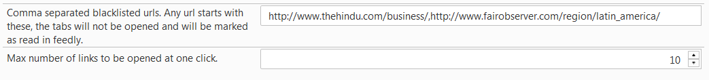

#   one-click-feeds-firefox
Firefox extension to open feedly feeds as tabs in one click.

# Features
  * Blacklisted URLs option
  * Maximum number of feeds to open option
# Usage
Navigate to extension page in firefox `about:addons`. Go to `Extensions --> One Click Feeds --> Options`

## Blacklisted URLs
It takes a comma separated urls as input. Any feed url that starts with any of these blacklisted urls will not open any tab and it will be automatically marked as read in feedly account so that it won't appear in future feedly page.

For Example in the above image, there are two urls given.
  * http://www.thehindu.com/business/
  : This options will mark all the business news from thehindu as read and no tabs will be opened.
  * http://www.fairobserver.com/region/latin_america/
  : This option will automatically mark all latin_america region news from fairobserver.

## Maximum number of feeds to open
This options enables to configure a max number of tabs to open at a time. For Example in the above option, maximum 10 tabs will be opened at a time.

# Installation

## Install signed extension
* Download latest xpi file. Open the xpi file using Firefox.

# Development

## Prerequisite for development
* nodejs
* jpm `npm install -g jpm`

# Development
  * `git clone https://github.com/kumar-b/one-click-feeds-firefox.git`
  * Run `jpm xpi`
  * Open `one-click-feeds.xpi` in Firefox
  * You may need to sign it using jpm to run in release version of firefox.

# Contribution

## Extended from
firefox-feedly-tabs by splattael
https://github.com/splattael/firefox-feedly-tabs

## Logo
Conceptualized and Designed by **Umashankar**
[umashankar.ng@gmail.com](mailto:umashankar.ng@gmail.com)

## License

[MIT License](LICENSE.txt)